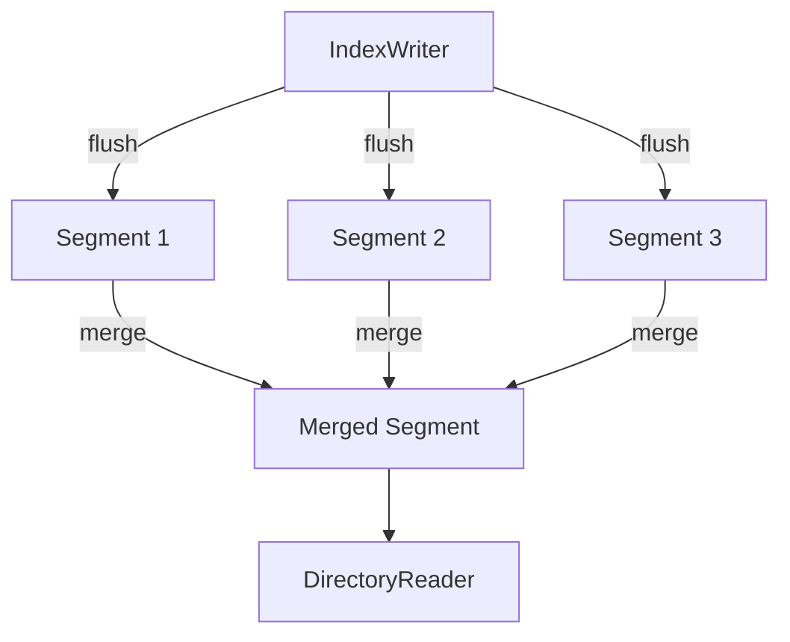
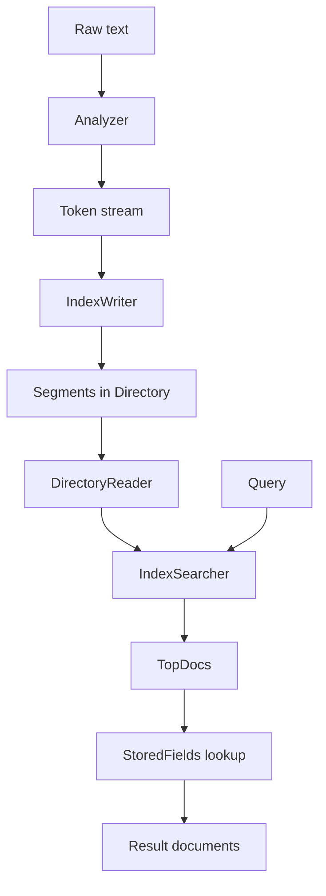

Understanding Lucene's model before writing code helps you make good decisions about field types, analyzer choice, and index design. This page explains each core abstraction and how they fit together.

## The read/write split

Lucene enforces a strict separation between writing to an index and reading from it. This is fundamental to how the library works.

| Concern | Class | Notes |
|---------|-------|-------|
| Write | `IndexWriter` | Creates, updates, and deletes documents. Holds a write lock on the `Directory`. Only one `IndexWriter` may be open per directory at a time. |
| Read | `DirectoryReader` | Opens the index read-only. A single reader instance represents a consistent point-in-time snapshot. |
| Search | `IndexSearcher` | Wraps a `DirectoryReader` and executes `Query` objects against it. Instances are fully thread-safe. |

```java
// Writing path
IndexWriter writer = new IndexWriter(directory, new IndexWriterConfig(analyzer));
writer.addDocument(doc);
writer.commit(); // makes changes visible to new readers
writer.close();

// Reading path
DirectoryReader reader = DirectoryReader.open(directory);
IndexSearcher searcher = new IndexSearcher(reader); // thread-safe; reuse it
```

<Note>
  `IndexSearcher` instances are completely thread-safe. For performance, share a single `IndexSearcher` across all threads rather than creating one per request. If the index changes, use `DirectoryReader.openIfChanged(DirectoryReader)` to get a refreshed reader cheaply.
</Note>

---

## Index

An **index** is the on-disk (or in-memory) data structure that Lucene builds from your documents. It lives inside a `Directory` — an abstraction over a file system path or a byte buffer.

- `FSDirectory` (and its subclass `NIOFSDirectory`) — writes index files to a directory on disk.
- `ByteBuffersDirectory` — stores everything in JVM heap memory. Useful for tests and short-lived indexes.

The index contains:
- An **inverted index** mapping each term to the list of documents containing it
- **Stored field** values for fields indexed with `Field.Store.YES`
- **Doc values** for numeric fields used in sorting and faceting
- **Norms** used during relevance scoring

---

## Segment

Internally, Lucene never modifies existing data. Instead, each flush from `IndexWriter` produces a new, immutable **segment**. A segment is a self-contained mini-index with its own inverted index, stored fields, and deletion bitset.



Over time, Lucene's **merge policy** (by default `TieredMergePolicy`) combines small segments into larger ones in the background. Merging keeps query performance high and reclaims space from deleted documents.

<Tip>
  Call `writer.forceMerge(1)` to collapse all segments into one after a bulk load, if the index will be mostly static. This improves query speed at the cost of a one-time, potentially expensive merge operation.
</Tip>

---

## Document

A **document** is the unit of indexing and retrieval in Lucene. It is an unordered collection of fields. There is no schema — every document can have different fields.

```java
Document doc = new Document();
doc.add(new StringField("id", "article-42", Field.Store.YES));
doc.add(new TextField("title", "Introduction to Lucene", Field.Store.YES));
doc.add(new TextField("body", "Full text of the article...", Field.Store.NO));
doc.add(new LongField("published", 1712000000L, Field.Store.NO));
```

When you retrieve a document from a search hit, you get back only the fields stored with `Field.Store.YES`.

---

## Field

A **field** associates a name with a value. The type of field determines how Lucene indexes and stores the value.

<AccordionGroup>

<Accordion title="TextField — full-text, analyzed">
  Use for human-readable text that should be tokenized and searched with terms. The configured `Analyzer` runs on the value before indexing.

  ```java
  // Tokenized and indexed; value also stored for retrieval
  doc.add(new TextField("body", "Apache Lucene is fast.", Field.Store.YES));

  // Tokenized and indexed from a Reader; value is NOT stored
  doc.add(new TextField("contents", new BufferedReader(reader)));
  ```

  Good for: article bodies, product descriptions, commit messages.
</Accordion>

<Accordion title="StringField — exact match, not analyzed">
  Use for identifiers, categories, paths, and other values that should match exactly. The analyzer is never applied; the whole string becomes a single term.

  ```java
  // Indexed as the single term "docs/index.md"; stored for retrieval
  doc.add(new StringField("path", "docs/index.md", Field.Store.YES));
  ```

  Good for: file paths, UUIDs, status codes, tags.
</Accordion>

<Accordion title="KeywordField — exact match with doc values">
  Similar to `StringField` but also writes doc values, enabling efficient sorting and faceting in addition to exact-match search.

  ```java
  // As used in IndexFiles.java demo
  doc.add(new KeywordField("path", file.toString(), Field.Store.YES));
  ```

  Good for: fields you need to both filter on exactly and sort/facet by.
</Accordion>

<Accordion title="LongField — numeric range and sorting">
  Indexes a `long` value using a point-based data structure. Supports efficient range queries via `LongField.newRangeQuery` and sorting via `LongField.newSortField`.

  ```java
  // As used in IndexFiles.java demo — last-modified timestamp in milliseconds
  doc.add(new LongField("modified", lastModified, Field.Store.NO));
  ```

  Good for: timestamps, prices, counts, version numbers.
</Accordion>

<Accordion title="KnnFloatVectorField — dense vector for similarity search">
  Stores a float array and builds an HNSW graph for approximate nearest-neighbor search. Requires specifying a `VectorSimilarityFunction`.

  ```java
  // As used in IndexFiles.java demo
  doc.add(new KnnFloatVectorField(
      "contents-vector", vector, VectorSimilarityFunction.DOT_PRODUCT));
  ```

  Good for: semantic similarity, embedding-based retrieval, hybrid search.
</Accordion>

</AccordionGroup>

---

## Term

A **term** is the atomic unit of search. It is a `(field, value)` pair — for example, `(title, "lucene")` or `(path, "docs/index.md")`.

When Lucene analyzes a `TextField` value, it produces a stream of terms. The string `"Apache Lucene is fast"` with `StandardAnalyzer` becomes the terms `apache`, `lucene`, `fast` (stop word "is" is removed).

```java
// A Term is used in TermQuery (exact match) and updateDocument
Term pathTerm = new Term("path", "docs/index.md");

// Update an existing document by term
writer.updateDocument(pathTerm, updatedDoc);
```

---

## Inverted index

The inverted index is the data structure at the heart of Lucene. Rather than mapping documents to the words they contain, it maps each word to the documents that contain it.

**Conceptual structure**

```
Term            → Postings list (document IDs + optional positions/offsets)
──────────────────────────────────────────────────────────────────────────
"lucene"        → [doc 0 (pos: 2), doc 1 (pos: 0, 5), doc 4 (pos: 1)]
"search"        → [doc 0 (pos: 3), doc 2 (pos: 0), doc 4 (pos: 2)]
"java"          → [doc 1 (pos: 7), doc 3 (pos: 1)]
"high-performance" → [doc 0 (pos: 1)]
```

When you search for `"lucene search"`, Lucene intersects the postings lists for `lucene` and `search`, finding `doc 0` and `doc 4`. BM25 then scores each matching document based on term frequency and inverse document frequency.

**Why this is fast**: looking up a term requires a single seek into a sorted structure (a finite-state automaton in Lucene's case), returning a compressed list of matching document IDs. Scanning every document's content is never necessary.

---

## Analysis

**Analysis** is the process of converting raw text into a stream of terms suitable for indexing or querying. An `Analyzer` chains together a `Tokenizer` and zero or more `TokenFilter`s.

`StandardAnalyzer` applies:
1. Unicode-aware tokenization (splits on whitespace and punctuation)
2. Lowercase filter
3. Stop-word filter (removes common words like "the", "is", "and")

```java
// The same analyzer must be used at index time and query time
// so that query terms match indexed terms.
Analyzer analyzer = new StandardAnalyzer();
IndexWriterConfig config = new IndexWriterConfig(analyzer);
QueryParser parser = new QueryParser("body", analyzer);
```

<Warning>
  Always use the same `Analyzer` (or a compatible one) when indexing and when parsing queries. Mismatched analyzers are a common source of zero-result queries: the indexed terms do not match the query terms.
</Warning>

The `lucene-analysis-common` module provides many built-in analyzers including language-specific ones (`EnglishAnalyzer`, `FrenchAnalyzer`, etc.) and building blocks for constructing custom pipelines.

---

## Query

A `Query` describes what to find. Lucene provides many query types, all under `org.apache.lucene.search`.

<AccordionGroup>

<Accordion title="TermQuery — exact term match">
  Matches documents containing an exact term. This is the most basic query and the building block for higher-level queries.

  ```java
  import org.apache.lucene.index.Term;
  import org.apache.lucene.search.TermQuery;

  Query q = new TermQuery(new Term("title", "lucene"));
  ```
</Accordion>

<Accordion title="BooleanQuery — combine clauses">
  Combines multiple queries using `MUST` (AND), `SHOULD` (OR), and `MUST_NOT` (NOT) clauses.

  ```java
  import org.apache.lucene.search.BooleanClause;
  import org.apache.lucene.search.BooleanQuery;

  Query q = new BooleanQuery.Builder()
      .add(new TermQuery(new Term("body", "lucene")), BooleanClause.Occur.MUST)
      .add(new TermQuery(new Term("body", "search")), BooleanClause.Occur.SHOULD)
      .add(new TermQuery(new Term("status", "draft")), BooleanClause.Occur.MUST_NOT)
      .build();
  ```
</Accordion>

<Accordion title="PhraseQuery — ordered word sequence">
  Matches documents where the specified terms appear in order, optionally with a configurable slop (number of intervening positions allowed).

  ```java
  import org.apache.lucene.search.PhraseQuery;

  Query q = new PhraseQuery("body", "apache", "lucene");
  ```
</Accordion>

<Accordion title="QueryParser — parse user input">
  Parses a query string using Lucene's query syntax. Suitable for user-facing search boxes.

  ```java
  import org.apache.lucene.queryparser.classic.QueryParser;

  QueryParser parser = new QueryParser("body", analyzer);
  Query q = parser.parse("apache lucene -draft");
  ```

  Supports `AND`, `OR`, `NOT`, field prefixes (`title:lucene`), wildcards (`luce*`), and phrase queries (`"apache lucene"`).
</Accordion>

<Accordion title="KnnFloatVectorQuery — approximate nearest neighbor">
  Finds the k documents whose stored float vector is closest to a query vector, using the HNSW graph built at index time.

  ```java
  import org.apache.lucene.search.KnnFloatVectorQuery;

  float[] queryVector = computeEmbedding("search query text");
  Query q = new KnnFloatVectorQuery("contents-vector", queryVector, 10);
  ```
</Accordion>

</AccordionGroup>

---

## TopDocs and results

`IndexSearcher.search(Query, int)` returns a `TopDocs` object containing the top-N matching documents sorted by score.

```java
TopDocs results = searcher.search(query, 10);

// Total number of matching documents (may be a lower bound for large result sets)
long totalHits = results.totalHits.value();

// Ranked hits
for (ScoreDoc hit : results.scoreDocs) {
    int docId = hit.doc;      // internal Lucene document ID
    float score = hit.score;  // BM25 relevance score

    // Retrieve stored fields for this document
    Document doc = searcher.storedFields().document(docId);
    String title = doc.get("title");
}
```

<Note>
  `search` and `searchAfter` count top hits accurately up to 1,000 matches. For result sets larger than 1,000, `totalHits.value()` may return a lower bound. The `scoreDocs` array is always accurate. To count all hits precisely, use a `TotalHitCountCollectorManager`.
</Note>

Lucene uses **BM25** as its default `Similarity`. BM25 scores a document higher when:
- The query term appears frequently in the document (term frequency)
- The term is rare across all documents (inverse document frequency)
- The document is shorter than average (length normalization)

You can replace the similarity by calling `IndexSearcher.setSimilarity(Similarity)` before searching.

---

## Putting it all together



1. You feed raw text and structured data to an `IndexWriter` as `Document` objects.
2. The `Analyzer` tokenizes `TextField` values into terms.
3. `IndexWriter` writes terms and stored values into a `Directory` as immutable segments.
4. A `DirectoryReader` opens a consistent snapshot of the index.
5. An `IndexSearcher` executes a `Query` against the reader, scoring each matching document.
6. `TopDocs` returns the highest-scoring document IDs; you load stored fields to get the original values.

<CardGroup cols={2}>
  <Card title="Quickstart" icon="bolt" href="/quickstart">
    See these concepts in action with a working code example.
  </Card>
  <Card title="Introduction" icon="house" href="/introduction">
    Back to the overview of what Lucene is and its architecture.
  </Card>
</CardGroup>
