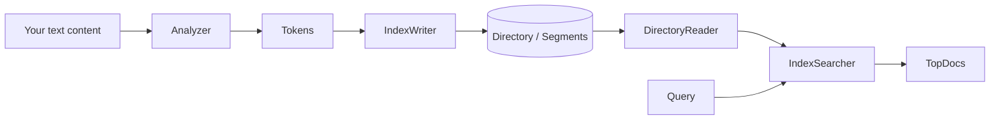

Apache Lucene is an open-source Java library for full-text search. It gives you the building blocks to add fast, scalable search to any Java application — without running a separate search server.

<Note>
  Lucene is a **library**, not a server. You embed it directly in your Java application. If you are looking for a ready-to-run search server built on Lucene, see [Apache Solr](https://solr.apache.org/) or [Elasticsearch](https://www.elastic.co/).
</Note>

## What Lucene is

- A Java library you add as a dependency to your project
- A toolkit for building inverted indexes over arbitrary text and structured data
- An engine that executes queries against those indexes and returns ranked results
- The foundation for most widely-used open-source search systems

## What Lucene is not

- A database — it does not replace a relational or document store
- A search server — it has no HTTP API or wire protocol out of the box
- A crawler or scraper — you are responsible for feeding documents to it
- A managed service — you operate it as part of your application

## Key use cases

**Application search** — embed Lucene to add a search box to a web app, mobile backend, or desktop tool. Index whatever content matters: articles, products, logs, code, messages.

**Search backends** — build a dedicated indexing and query service in Java. Lucene handles relevance ranking, faceting, highlighting, and geospatial queries at scale.

**Log and event analytics** — index structured fields alongside free text. Query by date range, category, and keyword in a single pass.

**Semantic and vector search** — since Lucene 9, the library includes native k-nearest-neighbor (KNN) vector search alongside classic term-based retrieval, enabling hybrid search pipelines.

## Architecture overview

Every Lucene workflow follows three phases:

**1. Analyze** — raw text passes through an `Analyzer` pipeline. The analyzer tokenizes the text, lowercases it, removes stop words, and applies stemming or other filters. The result is a stream of `Token`s ready to be indexed.

**2. Index** — an `IndexWriter` writes tokens and stored field values into a `Directory` (either on disk or in memory). Internally, Lucene organises data into immutable *segments* that are periodically merged. Each segment contains an inverted index mapping terms to the documents that contain them.

**3. Search** — a `DirectoryReader` opens the index read-only, and an `IndexSearcher` executes `Query` objects against it. Lucene scores matching documents using BM25 by default and returns a `TopDocs` result containing ranked `ScoreDoc` entries.

## Current version

These docs cover **Lucene 11.0.0**. Lucene 11 requires Java 25 and brings continued improvements to HNSW vector search, automaton handling, and merge policy configuration.

<Tip>
  Check the [CHANGES.txt](https://github.com/apache/lucene/blob/main/lucene/CHANGES.txt) file in the repository for the full list of changes in each release.
</Tip>

## Next steps

<CardGroup cols={2}>
  <Card title="Quickstart" icon="bolt" href="/quickstart">
    Add Lucene to a Java project, index documents, and run your first query in minutes.
  </Card>
  <Card title="Core concepts" icon="book-open" href="/core-concepts">
    Understand indexes, segments, documents, fields, analyzers, and queries before writing production code.
  </Card>
</CardGroup>
